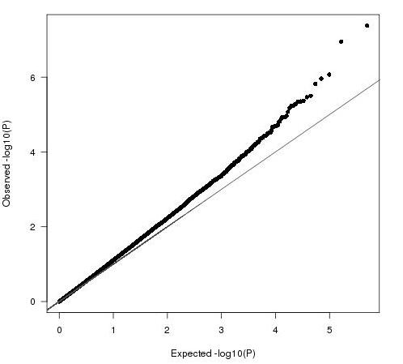

# statgenplots

🚧 *work-in-progress*

An R-Package (soon ;-) that implements QQplot and Manhattanplot as a geom in `ggplot2`.

This is similar to the package [`qqman`](http://www.gettinggeneticsdone.com/2014/05/qqman-r-package-for-qq-and-manhattan-plots-for-gwas-results.html), except that it should have the look and functionality of `ggplot2`.

[Functionality](#functionality)
[Development](#development)
[Inspiration](#inspiration)


## Functionality

Here is what the functions should do. 

Let's say we have GWAS summary statistics (P-value) for a number of SNPs (rowwise). That would look like this:

```
SNPid   P
rs3342  1e-2
rs83    1e-2
...     ...
```

What we want is first, a [Q-Q-plot](https://en.wikipedia.org/wiki/Q%E2%80%93Q_plot) representation of the P-values. Something like this. 

 
 
Secondly, we want a [Manhattan plot](https://en.wikipedia.org/wiki/Manhattan_plot).

<p><a href="https://commons.wikimedia.org/wiki/File:Manhattan_Plot.png#/media/File:Manhattan_Plot.png"></a><br>By M. Kamran Ikram et al - Ikram MK et al (2010) Four Novel Loci (19q13, 6q24, 12q24, and 5q14) Influence the Microcirculation In Vivo. PLoS Genet. 2010 Oct 28;6(10):e1001184. <a href="https://en.wikipedia.org/wiki/Digital_object_identifier" class="extiw" title="w:Digital object identifier">doi</a>:<a rel="nofollow" class="external text" href="https://doi.org/10.1371%2Fjournal.pgen.1001184.g001">10.1371/journal.pgen.1001184.g001</a>, <a href="https://creativecommons.org/licenses/by/2.5" title="Creative Commons Attribution 2.5">CC BY 2.5</a>, <a href="https://commons.wikimedia.org/w/index.php?curid=18056138">Link</a></p>

## Development

1. if needed, annotate dataset with chr and position
2. 

## Inspiration

- http://www.gettinggeneticsdone.com/2014/05/qqman-r-package-for-qq-and-manhattan-plots-for-gwas-results.html
- https://www.r-graph-gallery.com/wp-content/uploads/2018/02/Manhattan_plot_in_R.html

